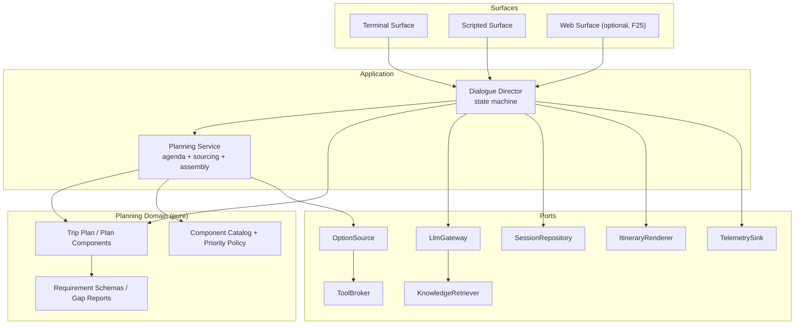
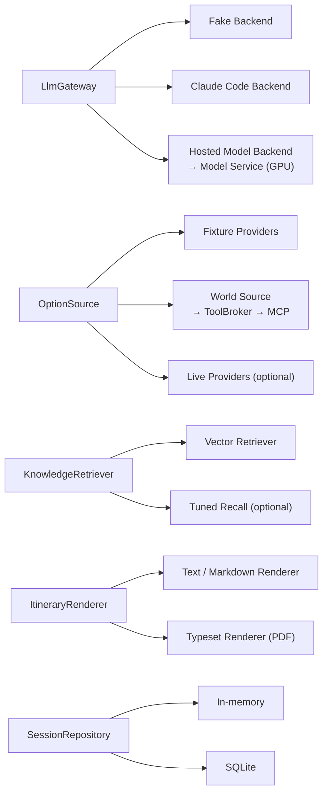

# Tourganize — Architecture Overview

Tourganize is a conversational trip-planning assistant. The traveller says what they want in English
or Hebrew; Tourganize interviews them for what is missing, plans the trip **one Plan Component at a
time**, offers a short Option Slate per component, lets them choose or push back, and finally exports a
written plan (PDF by default).

Read this file for the system shape. Read [glossary.md](glossary.md) for every term used here — the
vocabulary is normative. Read [decisions.md](decisions.md) for why each technology choice is what it
is, and [../roadmap.md](../roadmap.md) for the order in which all of it gets built.

---

## 1. Shape of the system

Tourganize is a **hexagonal (ports & adapters) application around a dependency-free planning domain**.
Two rules produce everything else:

1. **The domain imports nothing.** `tourganize.domain` and `tourganize.dialogue` may import the
   standard library and each other. They may not import an HTTP client, an LLM SDK, MCP, a PDF library,
   a terminal library, or a database driver. Enforced by an import-linter contract in CI (F01).
2. **Everything outside enters through a port.** A port is an abstract protocol in `tourganize.ports`
   with at least one fake adapter. Adapters are chosen from Settings, in one place: the Composition
   Root.



Adapters behind those ports (each one a feature, none of them known to the domain):



---

## 2. Bounded contexts

Six contexts. For each: what it owns, and — more importantly — what it is forbidden to know.

### 2.1 Trip Planning (the core domain)

- **Owns:** Trip Plan, Plan Component, Component Status, Component Kind, Component Catalog, Requirement
  Schema / Set / Value, Gap Report, Priority Policy, Planning Agenda, Plan Option, Option Slate,
  Selection, Plan Completeness.
- **Ubiquitous language:** a Trip Plan is a set of Plan Components; a Plan Component is Plannable when
  it has no blocking Gaps; planning it yields an Option Slate; accepting one Plan Option yields a
  Selection.
- **Must never know:** that a language model exists, that options come over a network, what a PDF is,
  what a terminal is, or what any specific travel topic is. `lodging` appears in a YAML catalog and in
  fixtures — never in a type name or an `if`.
- **Features:** F02, F03, F04.

### 2.2 Dialogue

- **Owns:** Planning Session, Transcript, User Turn, Turn Interpretation, Dialogue State, the state
  machine (Dialogue Director), Assistant Acts, the Choose-or-Refine Loop, blocking-question resolution,
  Proactive Offers, session closing.
- **Must never know:** how a turn was interpreted (a port did it), how an Act will be worded or drawn
  (the surface and Language Services do that), where options came from.
- **Features:** F05, plus F11 which tests it.

### 2.3 Language Services (supporting)

- **Owns:** LLM Gateway port and its Backends, Prompt Library and Prompt Templates, Extraction and
  Composition call shapes, Language Detector, Locale Tag handling, Message Catalogue, Bidi Shaping.
- **Must never know:** the Dialogue state machine's rules. It answers narrow language questions:
  "what does this turn mean, as this schema?", "say this payload in Hebrew".
- **Features:** F08, F09, F10, F21 (+F20 for the service it talks to).

### 2.4 Option Sourcing

- **Owns:** OptionSource port, Option Query, Fixture Providers, Tool Broker, MCP consumer, Cassettes,
  Live Providers, normalisation of provider payloads into Plan Options, Feasibility annotation.
- **Must never know:** the Dialogue state, the traveller's locale beyond passing it through, or how
  options will be presented. It answers "given these requirements, what candidates exist?"
- **Features:** F06, F15, F16 (the service it calls), F17, F24.

### 2.5 Knowledge Augmentation

- **Owns:** Knowledge Corpus, Supplementary Documents, Passages, ingestion, embeddings, Knowledge
  Retriever port, Citations, Grounding.
- **Must never know:** the planning domain's types. It deals in text, Passages and queries.
- **Features:** F18, F19, F23.

### 2.6 Presentation & Export

- **Owns:** Presentation Surface port and its adapters, rendering of Assistant Acts, RTL layout,
  Itinerary Document projection, Itinerary Renderer port and its adapters, Export Format selection.
- **Must never know:** why an Act was emitted, or anything about model or provider mechanics.
- **Features:** F07, F13, F14, F25.

**Cross-cutting (a platform concern, not a context):** Settings and secrets, logging, Turn Ledger
telemetry, container images and compose profiles, CI gates. Owned by F01, extended by F08 (LLM
telemetry) and F20 (GPU profile).

---

## 3. Package layout

```
tourganize/                 # ✔ F01
  __main__.py             # ✔ `python -m tourganize`
  py.typed                # ✔ the package ships type information
  domain/                 # ✔ pure: no third-party imports, ever
    trip/                 # ✔ TripPlan, PlanComponent, Selection, PlanCompleteness      (F02)
    requirements/         # ✔ RequirementSchema, FieldSpec, RequirementSet, GapReport   (F03)
    catalog/              # ✔ ComponentKind, ComponentCatalog, PriorityPolicy, Agenda   (F02/F04)
    options/              # ✔ PlanOption, OptionSlate, OptionQuery, Money, Provenance   (F02/F06)
  dialogue/               # ✔ pure: PlanningSession, DialogueState, DialogueDirector    (F05)
  ports/                  # ✔ abstract protocols only, stdlib-typed
    platform.py           # ✔ Clock, TelemetrySink, TelemetryEvent                      (F01)
  application/            # ✔ Composition Root and application services
    composition.py        # ✔ build_container: the only place adapters are constructed  (F01)
    diagnostics.py        # ✔ what `tourganize doctor` reports                          (F01)
  language/               # ✔ PromptLibrary, locale detection, MessageCatalogue, bidi   (F08/F10)
  adapters/
    clock/                # ✔ system/, fake/                                            (F01)
    telemetry/            # ✔ jsonl/, null/                                             (F01)
    options/              # ✔ fixture/, world/, live/                                   (F06, F17, F24)
    presentation/         # ✔ terminal/, scripted/, web/                                (F07, F25)
    llm/                  #   fake/, claude_code/, hosted/                              (F08, F09, F21)
    knowledge/            #   ingestion/, vector/, tuned/                               (F18, F19, F23)
    tools/                #   fastmcp_broker/, recorded/                                (F15)
    export/               #   text/, typeset/                                           (F13, F14)
    persistence/          #   memory/, sqlite/                                          (F12)
  platform/               # ✔ Settings, secrets, logging setup, errors
  cli.py                  # ✔ doctor, and stubs for chat, resume, export, docs, catalog
services/
  model_service/          # own container: HTTP façade + Inference Engine (F20)
  mcp_feasibility/        # own container: local FastMCP service (F16)
  model_tuning/           # own container: LoRA tuning jobs (F23, optional)
config/                   # ✔ directory exists; contents arrive with the features below
  catalog/components.yaml # Component Kinds, weights, schemas  (data, not code)   (F02)
  prompts/<version>/      # versioned Prompt Templates                            (F08)
  messages/<locale>.yaml  # Message Catalogue                                     (F10)
fixtures/
  options/                # Fixture Provider data                                 (F06)
  cassettes/              # recorded Tool Calls                                   (F15)
  conversations/          # Golden Conversations                                  (F11)
docker/                   # ✔ Dockerfiles, compose profiles: dev-cpu ✔, mcp (F16), gpu (F20)
tests/                    # ✔ see tests/README.md for the conventions
  unit/ integration/ contracts/ conversations/ architecture/
```

**✔ marks what exists today** (after F01); an unmarked directory is created by the feature
named beside it, which also fills a marked-but-empty package. A sub-package is never created
before the feature that puts something in it — the empty tree is documentation, not code.

---

## 4. The ports

Sketches, not final code. Each port's authoritative definition lives in the feature that introduces it.

```python
# tourganize/ports/llm.py                                       introduced by F08
class LlmGateway(Protocol):
    def extract(self, request: ExtractionRequest) -> ExtractionResult: ...
    def compose(self, request: CompositionRequest) -> CompositionResult: ...
    def capabilities(self) -> GatewayCapabilities: ...

# tourganize/ports/options.py                                   introduced by F06
class OptionSource(Protocol):
    @property
    def source_id(self) -> str: ...
    @property
    def kind_keys(self) -> frozenset[str]: ...
    def search(self, query: OptionQuery) -> OptionSourceResult: ...

# tourganize/ports/tools.py                                     introduced by F15
class ToolBroker(Protocol):
    def list_capabilities(self) -> Sequence[CapabilityDescriptor]: ...
    def invoke(self, call: ToolCall) -> ToolResult: ...

# tourganize/ports/knowledge.py                                 introduced by F18/F19
class KnowledgeRetriever(Protocol):
    def retrieve(self, query: KnowledgeQuery) -> Sequence[Passage]: ...

# tourganize/ports/presentation.py                              introduced by F07
class PresentationSurface(Protocol):
    def show(self, act: AssistantAct) -> None: ...
    def next_turn(self) -> UserTurn | None: ...   # None = traveller ended the session
    def notify(self, notice: SurfaceNotice) -> None: ...

# tourganize/ports/export.py                                    introduced by F13
class ItineraryRenderer(Protocol):
    @property
    def format_key(self) -> str: ...
    def render(self, document: ItineraryDocument) -> RenderedArtifact: ...

# tourganize/ports/persistence.py                               introduced by F12
class SessionRepository(Protocol):
    def save(self, session: PlanningSession) -> None: ...
    def load(self, session_id: str) -> PlanningSession: ...
    def list_recent(self, limit: int = 20) -> Sequence[SessionSummary]: ...

# tourganize/ports/interpretation.py                            introduced by F05
class TurnInterpreter(Protocol):
    def interpret(self, turn: UserTurn, context: DialogueContext) -> TurnInterpretation: ...

# tourganize/ports/language.py                                  introduced by F10
class LanguageDetector(Protocol):
    def detect(self, text: str, fallback: str) -> LocaleReading: ...

# tourganize/ports/catalog.py                                   introduced by F02/F04
class ComponentCatalog(Protocol):
    def kinds(self) -> Sequence[ComponentKind]: ...
    def get(self, kind_key: str) -> ComponentKind: ...
    def schema_for(self, kind_key: str) -> RequirementSchema: ...

class PriorityPolicy(Protocol):
    def order(self, candidates: Sequence[ComponentKind], plan: TripPlan) -> Sequence[str]: ...

# tourganize/ports/platform.py                                  introduced by F01
class Clock(Protocol):
    def now(self) -> datetime: ...

class TelemetrySink(Protocol):
    def record(self, event: TelemetryEvent) -> None: ...
```

Every port ships with a fake in the same feature that introduces it. That is what makes "stubs before
integrations" enforceable rather than aspirational.

---

## 5. The turn — data flow

One traveller turn, in the steady state (Phase 2 onward):

```mermaid
sequenceDiagram
  actor T as Traveller
  participant S as Presentation Surface
  participant D as Dialogue Director
  participant I as Turn Interpreter
  participant G as LlmGateway
  participant P as Planning Service
  participant O as OptionSource
  T->>S: utterance (en or he)
  S->>D: UserTurn
  D->>I: interpret(turn, context)
  I->>G: extract(prompt, schema)
  G-->>I: validated structure
  I-->>D: TurnInterpretation
  D->>P: apply requirement updates; recompute Agenda
  alt blocking Gap remains
    D->>G: compose(ask_blocking, locale)
    D-->>S: AssistantAct ask_blocking
  else component is Plannable
    P->>O: search(OptionQuery)
    O-->>P: Plan Options
    P-->>D: Option Slate
    D->>G: compose(present_slate, locale)
    D-->>S: AssistantAct present_slate
  end
  S-->>T: rendered reply (RTL-aware)
```

The Choose-or-Refine Loop is the branch on the *next* turn: intent `choose_option` records a Selection
and pops the Agenda; intent `refine` merges new Requirement Values and re-enters sourcing for the
**same** Plan Component with a new round index. Nothing bounds the number of rounds.

Mentioned-First is enforced in one place: the Agenda is rebuilt every turn as
`ordered(mentioned & unsettled) + ordered(unmentioned & not declined)`, and the Director only ever
plans `agenda[0]`. Proactive Offers begin only when the mentioned band is empty.

---

## 6. Phase 1 in one line

At the end of Phase 1 (F01–F07) the client runs `docker compose run --rm app tourganize chat`, types
*"find me a hotel in Paris between the 23rd and 28th of October"*, is asked for the one blocking detail
that is still missing, is shown three lodging options from fixtures, picks one, and sees a plain-text
summary of the plan. No LLM, no network, no GPU. Every later phase deepens that same path.

---

## 7. Constraint traceability (C1–C14)

| # | Constraint | Where it is honoured |
|---|---|---|
| C1 | Python project | F01 (package, tooling, CI) |
| C2 | Domain-driven design | F02–F05 (contexts + pure domain), F01 (import-linter contract enforcing it) |
| C3 | Every feature a Lego piece | The Contract section of all 25 feature files; F01 fixes the port/adapter convention |
| C4 | Gradual, explicitly ordered build | [../roadmap.md](../roadmap.md); every feature's DoD includes "previously working paths unaffected" |
| C5 | Runs in Docker | F01 (CPU app image + `dev-cpu` profile), F16 (MCP service image), F20 (GPU model image + `gpu` profile) |
| C6 | Production host: 3 GPUs (1× RTX 3090 Ti, 2× Quadro RTX 6000) | F20 + [D11](decisions.md#d11--single-gpu-per-worker-serving-4-bit-weights-14b-class-multilingual-model-the-ampere-card-is-not-in-the-serving-pool) |
| C7 | LLM must ultimately be open-weights from Hugging Face | F20 (serving), F21 (adapter + parity) |
| C8 | Interim LLM: Claude Code, mimicking the eventual conversation | F08 (one port, two call shapes), F09 (adapter), F21 (parity suite proving interchangeability) |
| C9 | OSS model over HTTP — Flask or FastAPI, upgrade allowed | F20 (Flask, framework-independent wire contract), F22 (FastAPI upgrade, deferred) |
| C10 | Supplementary documents usable by the model (RAG or Unsloth) | F18 + F19 (retrieval, first-class), F23 (Unsloth path, optional) |
| C11 | World information via MCP with FastMCP | F15 (FastMCP consumer + Cassettes), F17 (wired into sourcing) |
| C12 | At least one local MCP service, with proposals | F16, candidates and choice in [D12](decisions.md#d12--the-first-local-mcp-service-is-an-itinerary-feasibility-service) |
| C13 | UI is GUI or TUI | F07 (terminal, chosen in [D1](decisions.md#d1--terminal-surface-first-behind-a-presentation-surface-port)), F25 (web surface, optional) |
| C14 | Application named Tourganize | Root package `tourganize`, CLI `tourganize`, fixed in F01 |

---

## 8. Concern ownership (design brief §9)

Exactly one owning feature per concern; genuinely shared concerns are marked cross-cutting with a
single owner for the *mechanism*.

| Concern | Owner | Note |
|---|---|---|
| Conversation session lifecycle & turn handling | F05 | |
| Dialogue state machine & Choose-or-Refine Loop | F05 | |
| Language detection, bilingual & RTL handling | F10 | Cross-cutting; F10 owns the mechanism, F07/F13/F14 consume it |
| Per-component Requirement Schemas (mandatory vs optional) | F03 | Schema data lives in `config/catalog/` |
| Blocking-question resolution | F05 | Detection of blocking Gaps is F03; the resolution flow is F05 |
| Component prioritization policy & Mentioned-First rule | F04 | |
| Proactive offers for unmentioned components | F05 | |
| Option sourcing port + stub providers | F06 | |
| Real provider adapters | F24 | Deferred track |
| MCP consumer via FastMCP | F15 | |
| Local MCP server | F16 | |
| LLM Gateway port | F08 | |
| Prompt/template management | F08 | |
| Claude Code adapter | F09 | |
| Open-weights model server (Flask) | F20 | |
| FastAPI upgrade of that server | F22 | Deferred track |
| Document ingestion | F18 | |
| Knowledge retrieval & grounding | F19 | |
| Unsloth tuning path | F23 | Deferred track |
| Selection & plan assembly domain model | F02 | |
| Plan summary rendering (fallback formats) | F13 | |
| Plan summary rendering (PDF default, Hebrew-safe) | F14 | |
| Session/plan persistence | F12 | |
| Presentation surface (terminal) | F07 | |
| Presentation surface (GUI/web) | F25 | Deferred track |
| Configuration & secrets management | F01 | |
| Logging | F01 | |
| Metrics & cost observability (Turn Ledger) | F08 | Cross-cutting; F01 provides the sink port, F08 defines the per-turn record, F20/F21 extend it with server-side numbers |
| Test fixtures & fakes | F01 | Convention + first fakes; each later feature ships its own fake under it |
| Conversation-evaluation harness | F11 | |
| Docker/compose CPU dev profile | F01 | |
| Docker/compose GPU production profile | F20 | |
| CI & quality gates | F01 | Each feature adds its tests to the existing gates |

---

## 9. Questions for the client

Work is **not blocked** on any of these — the recommended defaults in
[decisions.md](decisions.md) are in force until answered.

1. **GPU line-up (please confirm).** The demands describe three "TU102-based" GPUs, but the RTX 3090 Ti
   is GA102/Ampere while the two Quadro RTX 6000 are TU102/Turing. We are proceeding on that reading
   ([D11](decisions.md)): serving on the matched Quadro pair, the 3090 Ti reserved for embeddings and
   tuning. If all three cards really are Turing — or if the 3090 Ti is the only one available for
   serving — tell us, because it changes the engine and quantization choice, not just a config value.
2. **Real provider accounts.** Will there be commercial flight/hotel/car API accounts (and whose terms
   of use apply), or are Fixture Providers plus MCP world data the permanent answer? F24 stays
   unscheduled until we know; nothing else waits on it.
3. **Multi-user, authentication, personal data.** We assume single-traveller, no login, no storage of
   passport/loyalty data ([D8](decisions.md)). If plans must be shared between people, or traveller
   profiles retained, that is a new feature and a data-protection conversation, not a config change.
4. **First demo target.** Is there a date or an audience for a first demo? Phase 1 is currently shaped
   as an internal walking skeleton; if it needs to be client-facing we would pull F10 (Hebrew) and F13
   (exported summary) forward, which is a re-ordering, not a redesign.
5. **Exported plan layout and branding.** Any required layout, logo, letterhead, font, or language
   convention for the exported document? F14's HTML/CSS template is the cheap place to honour it, and
   the cheap place changes once F14 has landed.
6. **Component Kinds beyond the first three.** We ship `air_travel`, `lodging`, `ground_transport`.
   Adding dining, activities, insurance or rail is a catalog entry plus fixtures — tell us which ones
   matter so the fixtures exist before the demo.
7. **Hebrew model quality bar.** F21 compares Claude with the self-hosted model on the same
   conversations. What is the acceptance bar for Hebrew wording quality, and who judges it?
