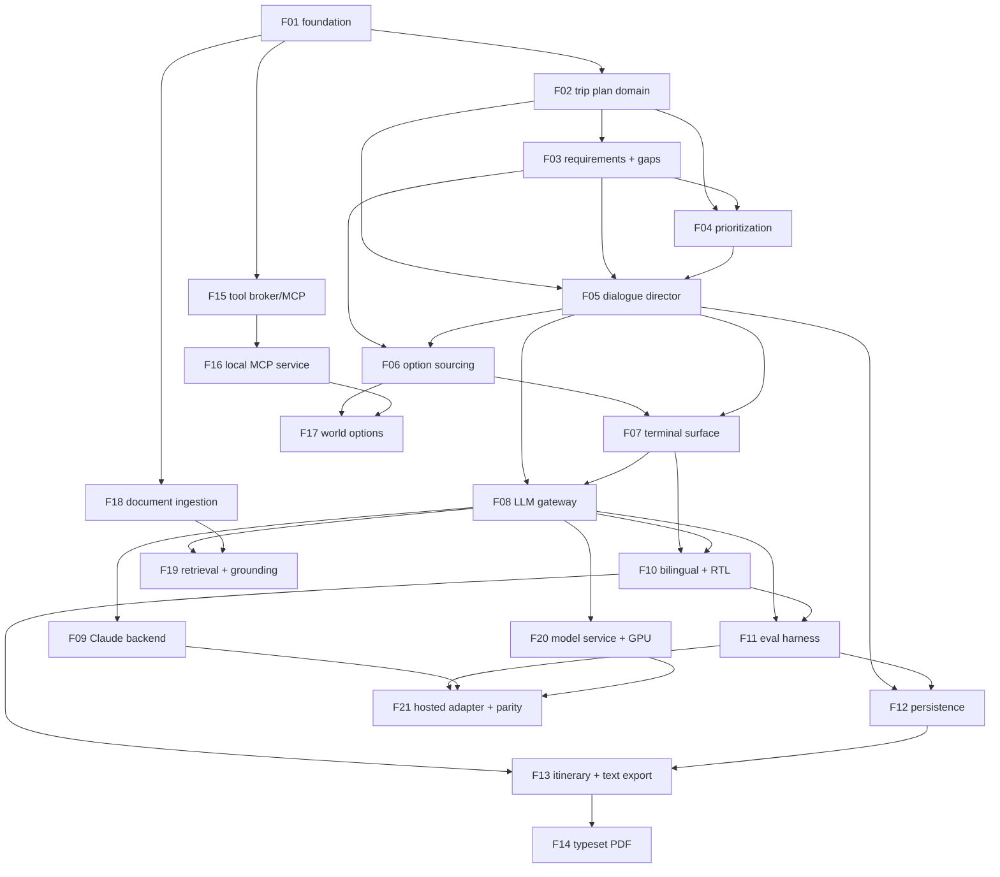
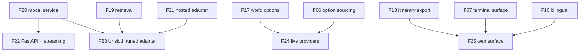

# Tourganize — Roadmap: phases, dependencies and build order

This is the file the client asked for by name: **what gets built, in what order, and what depends on
what**. It is the authority on dependency edges — where a feature file and this file disagree about an
edge, this file wins and the feature file gets fixed.

Twenty-five features. **Twenty-one form the core chain**; four are on an explicitly deferred track the
client can skip entirely without breaking anything. Every feature is implementable and verifiable on its
own, and every feature's Definition of Done includes *"the application still runs and previously working
paths are unaffected"* — so the project is never in a half-built state between features.

Terms used here are defined in [architecture/glossary.md](architecture/glossary.md); the reasoning behind
the technology choices is in [architecture/decisions.md](architecture/decisions.md).

---

## 1. Phases — what the client can see at the end of each

| Phase | Features | What is demonstrable when it ends |
|---|---|---|
| **1 — Walking skeleton** | F01 · F02 · F03 · F04 · F05 · F06 · F07 | One command in a container plans a hotel in Paris end to end: it asks for the missing dates, shows three options, takes a choice, offers to plan flights, and prints the plan. Fixture data, no model, no network, no GPU. |
| **2 — Real dialogue** | F08 · F09 · F10 · F11 | The same conversation in free-form English **and Hebrew**, understood by a real model (Claude Code) behind a swappable port, with the client's own rules — mentioned-first, blocking questions, unlimited choose-or-refine — pinned by a replayable Golden Conversation suite. |
| **3 — Durable, deliverable plans** | F12 · F13 · F14 | Close the laptop and resume tomorrow; the finished plan lands as a **PDF that is correct in Hebrew**, with markdown/plain-text as the always-works fallback and the format configurable. |
| **4 — Real world** | F15 · F16 · F17 | Options come from the outside world over **MCP/FastMCP**, and Tourganize's **own local MCP service** checks the plan actually coheres — "your flight lands after check-in closes" — with recorded fixtures keeping every test offline. |
| **5 — Own knowledge** | F18 · F19 | Hand it an airline's fare-rules PDF and ask about the change fee; it answers **with a citation to the page**, in either language, and refuses honestly when the documents do not say. |
| **6 — Own model** | F20 · F21 | Tourganize runs entirely on the client's hardware with an **open-weights Hugging Face model** on their GPUs, plus a parity report comparing it with Claude on identical conversations — tokens, latency, reliability, Hebrew fidelity. |
| **Deferred track** | F22 · F23 · F24 · F25 | Optional, independent, each skippable: async/streaming model service, Unsloth tuning path, live commercial providers, browser surface. |

**Phase 1 is the load-bearing one.** It exists to prove the decomposition works: seven features, each
individually verifiable, ending in something the client can run. Everything after it deepens that same
path rather than adding a parallel one.

---

## 2. Dependency graph — core chain



## 3. Dependency graph — deferred track



---

## 4. Ordered table

Feature numbers are a valid topological order: **no feature depends on a higher-numbered one.**

| # | Feature | Depends on | Phase | Size | Why here |
|---|---|---|---|---|---|
| F01 | [Project foundation, configuration and container baseline](features/F01-project-foundation.md) | — | 1 | M | *Infrastructure-only, justified:* it establishes the package layout, Settings convention, the two smallest ports, and the **import-linter contracts that mechanically enforce the DDD boundary** — the constraint every later feature depends on being real. |
| F02 | [Trip Plan domain core](features/F02-trip-plan-domain-core.md) | F01 | 1 | M | The vocabulary everything else speaks. Makes flights/lodging/car-rental **data** in a catalog rather than four branches, so adding a topic later is a YAML entry. |
| F03 | [Requirement schemas and gap analysis](features/F03-requirement-schemas-and-gap-analysis.md) | F02 | 1 | M | Encodes the client's blocking-vs-optional distinction per component, and produces the Gap Report the dialogue turns into questions. Nothing can be planned before this exists. |
| F04 | [Component prioritization policy](features/F04-component-prioritization-policy.md) | F02, F03 | 1 | S | Answers "what do we plan next": mentioned-first as a hard rule, everything else a replaceable policy — the home for the importance metric the client deferred. |
| F05 | [Dialogue director and session lifecycle](features/F05-dialogue-director-and-session-lifecycle.md) | F02, F03, F04 | 1 | L | The heart. Every behavioural rule the client stated lives here as one testable state machine, with no I/O, so it is fully verifiable before any adapter exists. |
| F06 | [Option sourcing and fixture providers](features/F06-option-sourcing-and-fixture-providers.md) | F02, F03, F05 | 1 | M | Real option *shape* from fixture *content*, behind the port every future provider implements. Unblocks the demo without waiting on accounts or APIs. |
| F07 | [Presentation surface and terminal shell](features/F07-presentation-surface-and-terminal-shell.md) | F05, F06 | 1 | M | Closes the walking skeleton — the first thing a human can use, and the Scripted Surface that makes everything after it testable. |
| F08 | [LLM gateway and prompt library](features/F08-llm-gateway-and-prompt-library.md) | F05, F07 | 2 | L | One door for every model call, two schema-validated call shapes, versioned prompts, and the Turn Ledger from the very first model feature — the artefact for the Claude-vs-own-model comparison. |
| F09 | [Claude Code backend adapter](features/F09-claude-code-backend-adapter.md) | F08 | 2 | M | Makes it genuinely intelligent using the subscription the client already has, isolated in one adapter so the swap to their own model is a config change. |
| F10 | [Bilingual conversation and RTL handling](features/F10-bilingual-and-rtl-handling.md) | F07, F08 | 2 | M | Hebrew as a first-class language rather than a flag: per-turn detection, bidi rendering, locale formatting. Cross-cutting, so it lands before persistence and export bake in English assumptions. |
| F11 | [Golden-conversation evaluation harness](features/F11-conversation-evaluation-harness.md) | F08, F10 | 2 | M | Turns the client's conversational rules into a regression suite that runs offline. Every later feature is safe *because* this exists — which is why it precedes them. |
| F12 | [Session and plan persistence](features/F12-session-and-plan-persistence.md) | F05, F11 | 3 | M | A plan that survives the process, so it can be resumed and re-exported. Placed after F11 so snapshot round-tripping is proven against the conversation suite. |
| F13 | [Itinerary projection and text/markdown renderer](features/F13-itinerary-rendering-and-text-renderer.md) | F10, F12 | 3 | M | The client's "summary in a configured format", delivered first in the format that cannot fail — and the document model the PDF renderer will consume. |
| F14 | [Typeset itinerary renderer (PDF, Hebrew-safe)](features/F14-typeset-itinerary-renderer.md) | F13 | 3 | M | The client's stated default format, with real bidi and an embedded Hebrew font. Second, so its native dependencies can never block the export path. |
| F15 | [Tool broker and FastMCP consumer](features/F15-tool-broker-and-mcp-consumer.md) | F01 | 4 | M | *Infrastructure-only, justified:* it is the determinism boundary for all world access — allowlisted capabilities plus recorded cassettes — so F16 and F17 do not each invent a client and a mocking strategy. |
| F16 | [Local MCP service: itinerary feasibility](features/F16-local-feasibility-mcp-service.md) | F15 | 4 | M | The client's required local MCP service, chosen because it is useful on day one, deterministic, and offline-testable — and it exercises the FastMCP **server** side. |
| F17 | [World-backed option source and feasibility annotation](features/F17-world-backed-option-source.md) | F06, F15, F16 | 4 | M | Connects world data and the feasibility verdict into the actual conversation, with fixtures as the configured fallback so a dead server never ends a session. |
| F18 | [Document ingestion and knowledge corpus](features/F18-document-ingestion-and-corpus.md) | F01 | 5 | M | Accepts the client's supplementary documents into versioned, anchored Passages — a small verifiable step before any retrieval machinery. |
| F19 | [Knowledge retrieval and grounded answers](features/F19-knowledge-retrieval-and-grounding.md) | F08, F18 | 5 | L | Makes those documents usable, with citations and an honest refusal when the corpus is silent. The first-class answer to C10. |
| F20 | [Model service and GPU profile](features/F20-model-service-and-gpu-profile.md) | F01, F08 | 6 | L | Stands up the open-weights model on the client's hardware behind a framework-independent wire contract — without yet switching the app, so a hardware surprise cannot break a working product. |
| F21 | [Self-hosted model adapter and backend parity](features/F21-self-hosted-model-adapter-and-parity.md) | F09, F11, F20 | 6 | M | Completes C7: one config value runs everything on the client's own model, and the parity report turns "is it good enough?" into evidence. |
| F22 | [Model service async upgrade (FastAPI)](features/F22-model-service-async-upgrade.md) | F20 | deferred | M | The migration promised when Flask was chosen: same contract, async admission, cancellation, streaming. |
| F23 | [Tuned knowledge adapter (Unsloth)](features/F23-tuned-knowledge-adapter.md) | F19, F20, F21 | deferred | L | The second path named in C10, behind the same retriever port, with a refusal-correctness gate before adoption. |
| F24 | [Live option provider adapters](features/F24-live-option-provider-adapters.md) | F06, F17 | deferred | M each | Real commercial inventory behind the unchanged port — **blocked on the client supplying accounts, keys and terms of use.** One feature per provider. |
| F25 | [Web presentation surface](features/F25-web-presentation-surface.md) | F07, F10, F13 | deferred | L | The GUI half of C13, as a second adapter — and the proof that the presentation port boundary was real. |

---

## 5. Critical path and what can run in parallel

**Critical path (13 features):**

```
F01 → F02 → F03 → F04 → F05 → F06 → F07 → F08 → F10 → F11 → F12 → F13 → F14
```

Everything else hangs off this spine. If one person is building, this is simply the order — with the
off-path features inserted where their phase says.

**Genuinely parallelizable** (a second implementer can take these without waiting):

| Can start after | Features | Note |
|---|---|---|
| F01 | **F15**, **F18** | Both depend on nothing else. They are the natural work for a second person during Phase 1–2, and both are inert until wired, so they cannot destabilise the spine. |
| F08 | **F09**, **F20** | The Claude adapter and the Model Service are independent of each other and of F10–F14. F20 is the long-lead item (GPU host, weights, measurement) — starting it early is the single best scheduling decision available. |
| F15 | **F16** | Independent of the whole spine. |
| F16 + F06 | **F17** | Needs Phase 1 complete only for F06. |
| F18 + F08 | **F19** | Independent of F10–F14. |
| F13 | **F25** | Deferred, but unblocked from the end of Phase 3. |

**Sequencing constraints worth stating explicitly:**

- **F10 before F12/F13/F14.** Persistence and export must be built once, bilingually. Retrofitting Hebrew
  into a stored snapshot format and a PDF template is the expensive version of this project.
- **F11 before F12 and everything after.** The harness is what makes later features safe; building it
  later means every feature between then and now was unprotected.
- **F20 before F21, never merged with it.** Standing up a GPU model and switching the application to it are
  different risks and need separate Definitions of Done.
- **F13 before F14.** The always-works renderer exists before the one with native dependencies, so the
  export path can never be entirely broken.
- **F06 before F17/F24.** The port and its contract suite must exist before any real source, or the
  "a stub's shape may never differ from the real one" rule has nothing to enforce it.

**Two-person schedule, if wanted:** A takes the spine (F01→F07, then F08, F10, F11, F12→F14); B takes F15,
F18 during Phase 1, then F09 and F16 during Phase 2, then F20 (long lead) and F19, joining A for F17 and
F21. No feature ever needs both people at once.

---

## 6. Deferred / optional track

These are **safe to skip**. Nothing in F01–F21 depends on them, and skipping any of them leaves a complete,
working product.

| Feature | Skip it if… | Cost of skipping |
|---|---|---|
| **F22** — FastAPI migration | The model service's throughput and latency on Flask are acceptable and no surface wants streaming. | No token streaming, no request cancellation (an abandoned turn holds the GPU until it finishes), concurrency bounded by WSGI workers. |
| **F23** — Unsloth tuning path | Retrieval (F19) answers document questions well enough — which is the expected outcome, per [D6](architecture/decisions.md). | No adaptation of the model's terminology to the client's documents, and slightly higher per-turn token cost from grounding. C10 is already satisfied by F19. |
| **F24** — Live providers | Fixture and MCP-sourced options are enough for the intended use, or accounts and terms are not in place. | Options are not real bookable inventory. **This feature cannot start until the client answers overview §9 question 2.** |
| **F25** — Web surface | The terminal surface suits the users. | No browser access, and Hebrew is rendered in the weaker of the two environments (a terminal rather than a browser). |

Two of these are, in a sense, insurance policies for decisions taken earlier: F22 is what made choosing
Flask first free ([D7](architecture/decisions.md)), and F23 is what made choosing retrieval first
non-exclusive ([D6](architecture/decisions.md)).

---

## 7. Rules that hold across the whole plan

1. **One feature at a time, and the app runs after each.** Every Definition of Done ends with "previously
   working paths unaffected", and from F11 onward that is machine-checked by the Golden Conversation suite.
2. **A feature may depend only on what another feature's spec *declares*** — its Contract section — never on
   its internals. That is what makes any feature replaceable by a better version later.
3. **Fakes before integrations.** Every port ships a fake in the feature that introduces it, so no feature
   is ever blocked on a GPU, an API key, or a subscription.
4. **No feature adds a name the glossary does not have.** New vocabulary goes into
   [architecture/glossary.md](architecture/glossary.md) in the same change.
5. **Sizes are honest.** The three `L` features (F05, F08, F19 — plus F20 and F23 on their tracks) each
   carry an explicit split suggestion in their spec for the case where one sitting is not enough. F05 is
   the one that should **not** be split, and its spec says why.
6. **Client questions never block progress.** The seven open questions in
   [architecture/overview.md §9](architecture/overview.md) all have a recommended default in force; only
   F24 is genuinely gated on an answer, and it is on the deferred track for exactly that reason.
